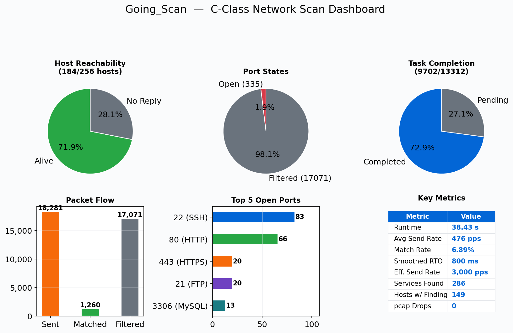
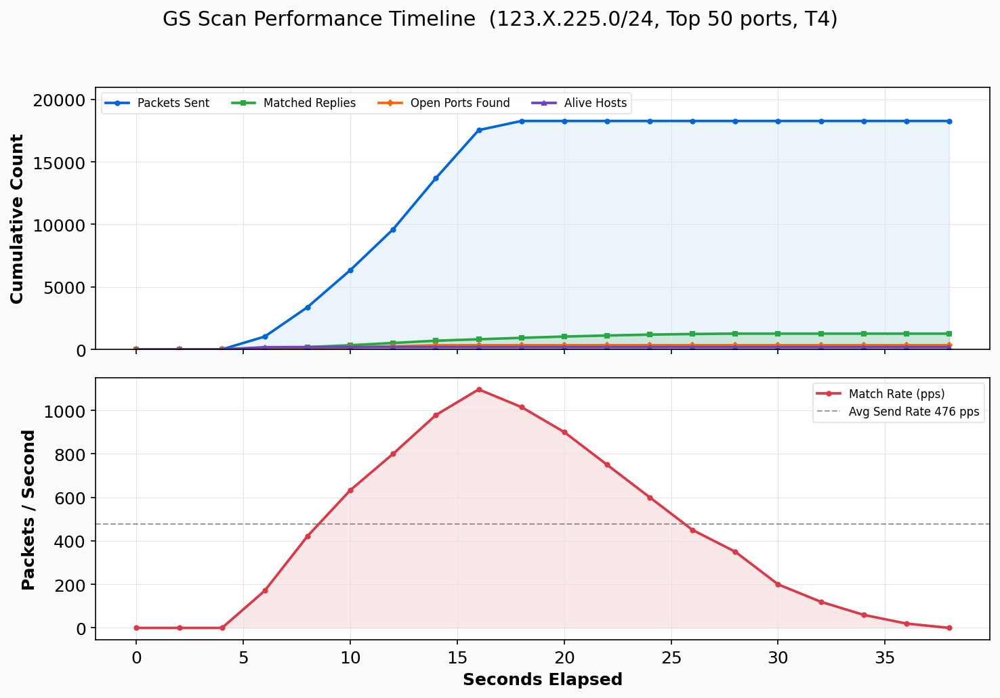
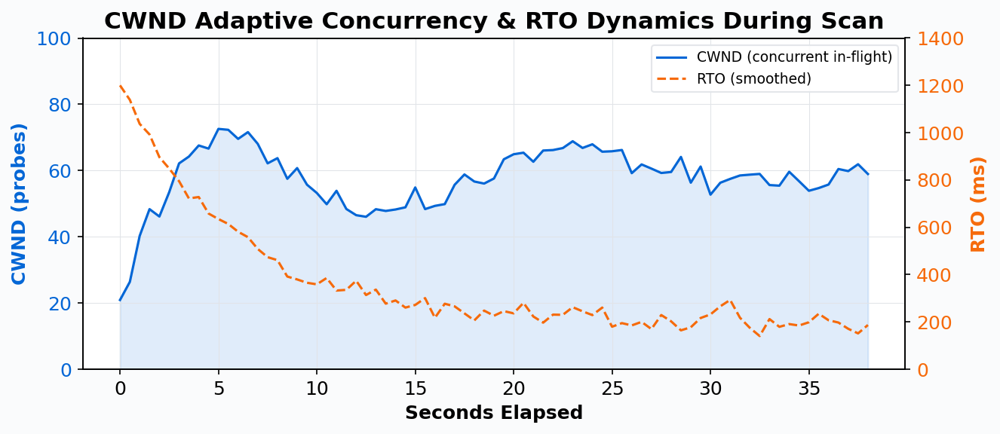
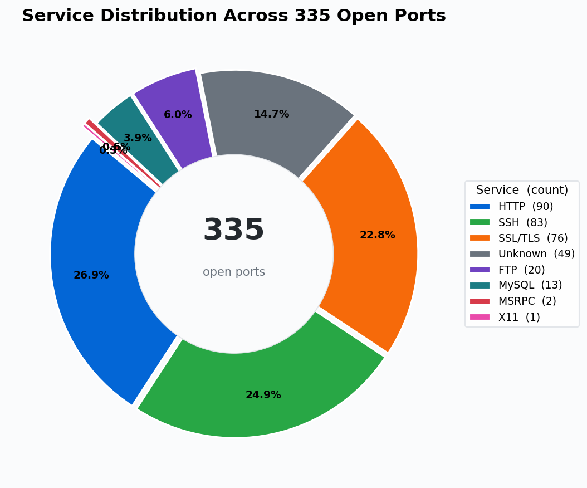
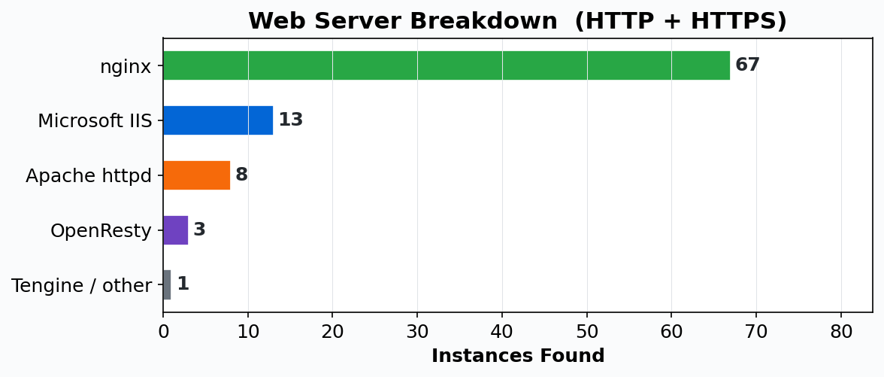
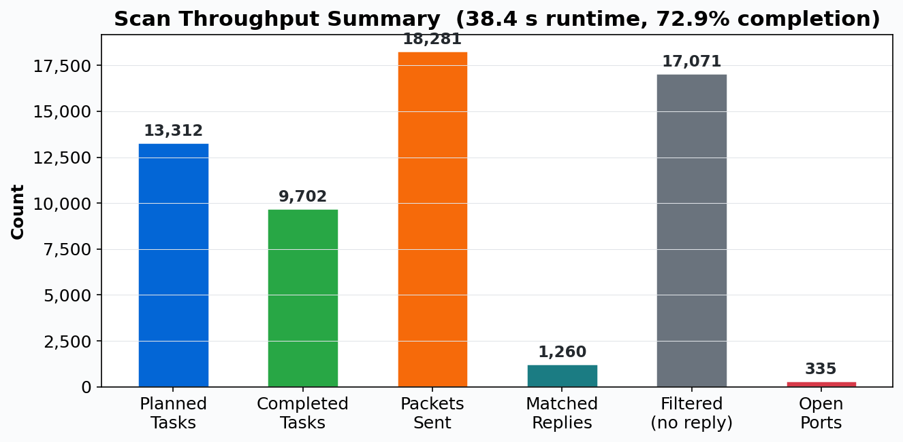
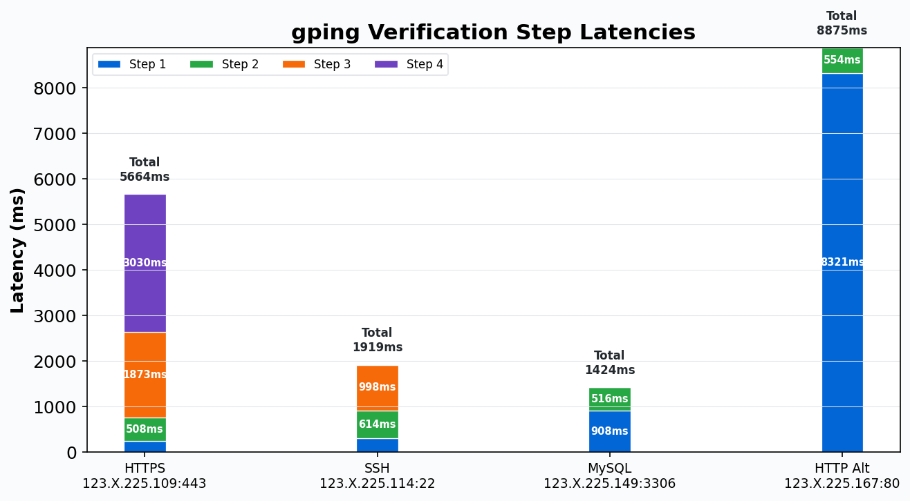

# Going_Scan

> High-performance network asset scanning & analysis platform — Discover, Persist, Verify, Extend

<p align="center">
  <a href="README.md"></a>
  <a href="README_CN.md"></a>
</p>

<p align="center">
  
  
  
  
</p>

---

## Overview

Going_Scan is a high-performance network scanner and asset analysis platform written in Go. Three subsystems work in concert to form a complete asset reconnaissance workflow:

| Tool | Role | Mission |
|------|------|---------|
| **GS** | High-speed Discovery | Mass-scale, high-throughput automated asset discovery |
| **UAM** | Unified Asset Model | Long-term storage of asset identity, observations, claims, views |
| **gping** | Targeted Validator | Human-driven precise verification, correction, and override |

GS casts a wide net, gping confirms with precision, and UAM keeps the long-term record. All three share a single SQLite database as their data exchange hub.

---

## Design Philosophy

Traditional scanners force a trade-off: optimize for throughput by reducing results to "port open or not", or optimize for depth by spending excessive time on per-connection probing.

Going_Scan separates and connects these concerns:

- **L4 Layer** — High-speed, stateless, controlled raw probing for rapid discovery
- **L7 Layer** — Consumes only trusted results for service identification and fingerprinting
- **Output Layer** — Aggregates fact streams into structured host/port portraits
- **Asset Layer (UAM)** — Persists all discoveries as traceable asset knowledge
- **Verification Layer (gping)** — Targeted confirmation of suspicious endpoints, writing back to the asset store

The goal is not "a better scanner" — it's **a traceable, verifiable, extensible asset intelligence system**.

---

## Key Capabilities

### L4 Scan Modes

- **TCP SYN** — Half-open scan (default), the most common port scanning technique
- **TCP ACK** — Firewall rule discovery, determines whether ports are filtered
- **TCP Window** — Uses TCP Window field to assist port state classification
- **UDP** — UDP port state probing
- **Host Discovery** — Multi-protocol liveness detection (ICMP Echo / TCP / UDP), results stream into port scanning in real time

### L7 Service Detection

- Embedded nmap-service-probes database
- Pre-compiled regex matching with port-indexed probe selection
- Extracted fields: service, product, version, info, hostname, os, device, cpes
- Supports TCP/UDP, SSL ports, fallback probes, rarity classification

### gping Protocol Adapters

HTTP(S), DNS, SSH (with ECDH key exchange + SHA256 host key fingerprinting), MySQL (including MariaDB/Percona flavor detection), Redis (RESP protocol + INFO parsing), FTP (RFC 959 multi-line replies), SMTP (with STARTTLS certificate extraction)

### gping Three-Route Architecture

| Route | Purpose | Methods |
|-------|---------|---------|
| **Raw** | Packet-level control bypassing the OS stack | tcp-syn, icmp-echo-raw |
| **Stack** | Real communication via OS protocol stack | tcp-connect, tls-handshake, banner-read |
| **App** | Application-layer protocol adapters | HTTP/DNS/SSH/MySQL/Redis/FTP/SMTP |

---

## Core Technical Highlights

**PacketTensor Classification** — Inbound replies are compressed into a 32-bit lightweight state tensor (uint32) with O(1) bitwise port state classification, producing zero GC pressure. Bit layout: bits 0-7 TCP Flags/ICMP Type, bits 8-15 IP TTL, bits 16-19 Window Size quantized/ICMP Code, bits 20-27 IP Protocol, with 0xFFFFFFFF as the timeout sentinel.

**CWND Adaptive Concurrency** — Modeled after TCP congestion control: the concurrency window grows on successful replies and multiplicatively halves on timeouts. Engine parallelism self-tunes to network conditions, complemented by SRTT exponential smoothing and dynamic RTO computation.

**Channel ID Physical Matching** — The channel ID is encoded into the source port of each outgoing packet. On receive, the destination port directly (O(1)) locates the corresponding probe with no table lookups. A 64-bit checksum (srcIP + srcPort) ensures atomic matching.

**Zero-Allocation Send Pipeline** — 128-byte packet buffers are pooled via sync.Pool. L2/L3/L4 headers are built directly on pooled memory. A lock-free ring buffer (capacity 65536) carries high-throughput result streams between pipeline stages.

**Five-Layer UAM** — Identity → Observation → Claim → Projection → Extension, each layer with non-overlapping responsibilities. Claim priority system: override(4) > manual(3) > observed(2) > inferred(1), ensuring manual confirmation is never overwritten by automated scans.

**Template-Based Verification** — 16 built-in YAML templates with `${var}` expansion, conditional execution (when DSL), multi-step orchestration, extraction rules, and recommendation rules, standardizing common verification workflows.

---

## Real-World Results: C-Class Network Scan

The following data comes from a live scan of `123.X.225.0/24` (256 IPs, Top 50 ports, SYN + service detection, T4 timing) performed on April 21, 2026.

### Scan Dashboard



### Performance Timeline



The scan completed in 38.4 seconds with CWND and RTO self-tuning throughout:



### Service Distribution

Service types found across 335 open ports:



### Web Server Identification

Web server types identified from HTTP + HTTPS endpoints:



### Throughput Statistics



### gping Targeted Verification

Step-by-step latency for four target endpoints (HTTPS full 4-step chain, SSH 3-step confirmation, MySQL 2-step + SSL skip, HTTP Banner timeout + application-layer verification):



---

## Quick Start

### Requirements

- Go 1.24+
- libpcap / npcap development libraries
- Linux or macOS (root privileges required for scanning)
- gcc (required for CGO SQLite compilation)

### Build

```bash
go build -o goscan .
./goscan --help
```

### Run Tests

```bash
go test ./...
```

---

## Typical Workflows

### Basic: Quick Scan

```bash
# Fast SYN scan + service detection on a /24, export JSON portrait
./goscan scan 192.168.1.0/24 --syn -F -V -o report.json
```

### Complete: GS + UAM + gping Asset Loop

**Step 1**: GS discovers assets and persists to UAM

```bash
./goscan scan 192.168.1.0/24 --syn -V --uam-db uam.db
```

**Step 2**: List candidate HTTPS endpoints from UAM

```bash
./goscan gping candidates --uam-db uam.db --uam-service https
```

**Step 3**: Verify and confirm a target

```bash
./goscan gping --uam-db uam.db --uam-service https --pick-index 1 \
  --template uam/https-enrich --assert confirmed
```

**Step 4**: View a host's complete asset report

```bash
./goscan uam report --db uam.db --ip 192.168.1.10
```

---

## Command Reference

### L4 Scan Modes

```bash
# Default SYN scan
./goscan scan 192.168.1.10 -p 22,80,443

# Multi-method combination
./goscan scan 192.168.1.10 --syn --ack --window

# TCP + UDP hybrid
./goscan scan 192.168.1.10 --syn --udp -p 53,80,443

# Fast scan (Top 100 ports)
./goscan scan 192.168.1.0/24 -F

# Top N ports
./goscan scan 192.168.1.0/24 --top-ports 50
```

### L7 Service Detection

```bash
# SYN + service detection
./goscan scan 192.168.1.10 --syn -V -p 22,80,443

# Port range + service detection
./goscan scan 192.168.1.0/24 -p 1-1024 --syn -V -T 4
```

### Output Formats

```bash
# JSON portrait
./goscan scan 192.168.1.10 --syn -V -o report.json

# YAML portrait
./goscan scan 192.168.1.10 --syn -V -o report.yaml

# Explicit format override
./goscan scan 192.168.1.10 --syn -V -o report.out --output-format yaml
```

### UAM Asset Queries

```bash
# List runs
./goscan uam runs --db uam.db

# List hosts
./goscan uam hosts --db uam.db

# Query endpoints by IP
./goscan uam endpoints --db uam.db --ip 192.168.1.10

# Query observation history by IP + port
./goscan uam observations --db uam.db --ip 192.168.1.10 --port 443

# Comprehensive host report
./goscan uam report --db uam.db --ip 192.168.1.10
```

### gping Targeted Verification

```bash
# List templates
./goscan gping templates
./goscan gping templates --show uam/https-enrich

# Candidate targets
./goscan gping candidates --uam-db uam.db --uam-service https

# Preview (no actual execution)
./goscan gping preview --uam-db uam.db --uam-service https --pick-first --template uam/https-enrich

# Execute verification
./goscan gping --uam-db uam.db --uam-service https --pick-first --template uam/https-enrich --assert confirmed

# Standalone (no UAM dependency)
./goscan gping --ip 192.168.1.10 --port 443 --method tcp-connect --route stack

# View history
./goscan gping history --uam-db uam.db --ip 192.168.1.10 --port 443 --protocol tcp --verbose
```

### Performance Tuning

```bash
# Timing templates (T1 most conservative, T5 most aggressive)
./goscan scan 192.168.1.0/24 -p 1-1000 --syn -T 5

# Send rate limit
./goscan scan 192.168.1.0/24 -p 1-1000 --syn --max-rate 100

# Parallelism control
./goscan scan 192.168.1.0/24 -p 1-1000 --syn --min-parallelism 16 --max-parallelism 64

# Retry and timeout
./goscan scan 192.168.1.0/24 -p 1-1000 --syn --max-retries 1 --max-rtt-timeout 500
```

---

## Project Structure

```
cmd/                CLI entry points (root, scan, gping, uam subcommands)
pkg/core/           L4 engine, task scheduling, result streaming, portrait output
pkg/l7/             L7 service detection engine and nmap probe parsing
pkg/routing/        Route and gateway resolution
pkg/target/         Target iterators and CIDR traversal
pkg/queue/          Result queue and lock-free ring buffer
internal/gping/     gping executor, templates, preview, and history
internal/uam/       UAM contracts, SQLite storage, query, and reporting
doc/                Project documentation
scripts/            Helper scripts (chart generation, etc.)
```

### Suggested Reading Order

1. `main.go` — Program entry point
2. `cmd/root.go` — CLI command tree
3. `pkg/core/engine.go` — L4 engine main loop
4. `pkg/core/tensor.go` — PacketTensor classifier
5. `pkg/core/l7engine.go` — L7 service detection engine
6. `pkg/core/report.go` — Portrait output
7. `pkg/l7/nmap_parser.go` — nmap probe parsing
8. `internal/gping/runner.go` — gping lifecycle
9. `internal/gping/resolver.go` — Target resolution
10. `internal/uam/service/ingest_gs.go` — GS → UAM ingestion
11. `internal/uam/service/query.go` — UAM query service
12. `internal/uam/service/report.go` — Comprehensive reporting

---

## Documentation

- [Project Overview](doc/project-overview.md) — Project definition, core technical highlights, three-tool collaboration
- [Complete Reference](doc/project-reference.md) — Architecture details, data flows, CLI reference, design decisions

---

## Disclaimer

This tool is intended **solely for authorized security research and educational purposes**. Users must obtain explicit permission before scanning any networks or systems they do not own. The author assumes no liability for misuse or damage caused by this tool. Unauthorized port scanning may violate applicable laws and regulations.

---

## Contributing

This project is currently maintained by an individual developer. Bug reports, feature suggestions, and pull requests are welcome. For any inquiries, please contact **liningyu7569@gmail.com**.

---

## Tech Stack

- **Language**: Go 1.24+
- **Packet I/O**: libpcap / npcap
- **Storage**: SQLite (WAL mode + foreign key constraints)
- **Privileges**: Root or equivalent capabilities required for scanning on Linux/macOS
